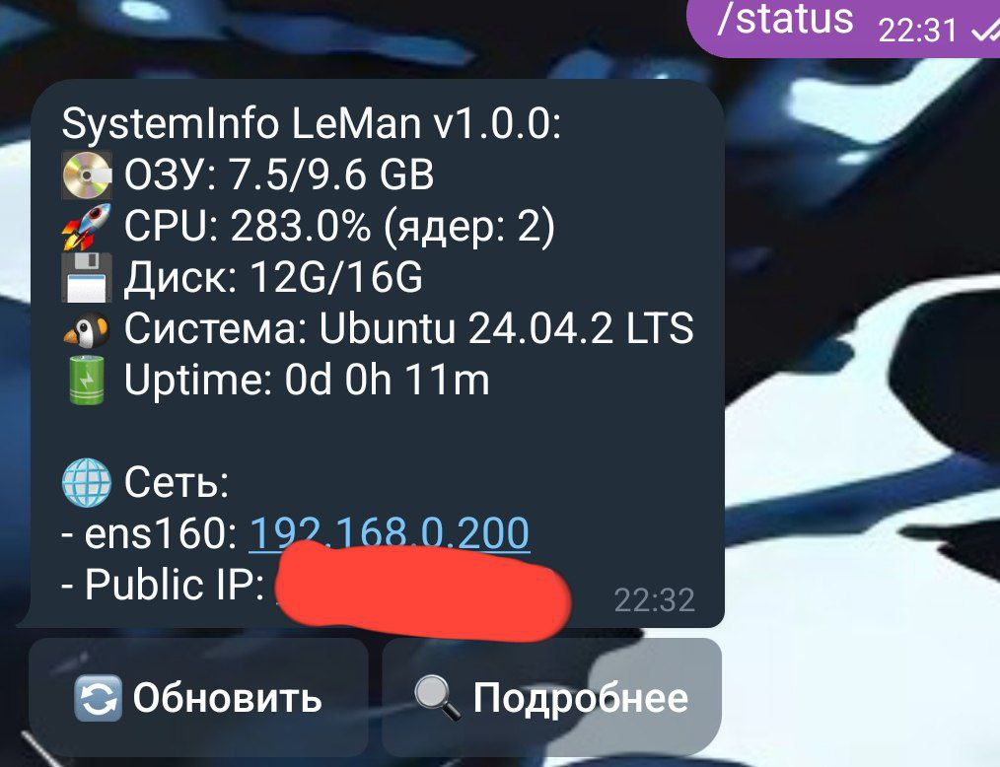

# ServerStatusLM
Monitoring your VDS/VPS server on Linux.
ServerStatusLM/1.jpg

## 😁A completely free utility for monitoring the status of your VPS/VDS server on Linux using a telegram bot.


Development plans:
- CPU and GPU temperature display (if available)
- mailing from the bot if the server has critical temperatures
- a log for recording the temperature once in a given period of time
- storing all settings and the bot token in a separate file
- control of some server systems using buttons

# ⚡=== How to install? [ENG] ===
1. First, you need to upload the bot to your server. You can do this via SSH, SMB, or by copying a file from GitHub.
2. Now we need to download several packages, thanks to which the bot will work.
   ```
   sudo apt update && sudo apt upgrade
   ```
   ```
   sudo apt install nodejs npm
   ```
   Install NodeJS and NPM. Perhaps you have another package manager other than apt, use the documentation of your Linux distribution.
3. Now we need to create a Telegram bot and get its token. To do this, we need the bot @BotFather. I think you can create a bot yourself and take its token.
4. Now you need to find the line "const bot = new TelegramBot('YOUR_TELGRAM_BOT_TOKEN', {polling: true });" and change "YOUR_TELGRAM_BOT_TOKEN" to your token.
5. Great, now you can run the bot.
   ```node index.js```

You can set the bot to auto-start with the system so that it starts automatically with your server. I've run tests on Debian, Arch, Ubuntu, Mint, Fedora.
The bot is completely free, you can freely modify it and distribute it, but I really ask you to keep the information about the original source, at least a link to this repository.

# ⚡=== Как установить? [RU] ===
1. Сначала вам нужно загрузить бота на свой сервер. Вы можете сделать это через SSH, SMB или скопировав файл с GitHub.
2. Теперь нам нужно загрузить несколько пакетов, благодаря которым бот будет работать.
   ```
   sudo apt update && sudo apt upgrade
   ```
   ```
   sudo apt install nodejs npm
   ```
   Установите NodeJS и NPM. Возможно, у вас есть другой менеджер пакетов, отличный от apt, воспользуйтесь документацией вашего дистрибутива Linux.
3. Теперь нам нужно создать Telegram-бота и получить его токен. Для этого нам понадобится бот @BotFather. Я думаю, вы можете сами создать бота и взять его токен.
4. Теперь вам нужно найти строку "const bot = new TelegramBot('YOUR_TELGRAM_BOT_TOKEN', {опрос: true})" и изменить "YOUR_TELGRAM_BOT_TOKEN" на ваш токен.
5. Отлично, теперь вы можете запускать бота.
 ```node index.js```

Вы можете настроить автоматический запуск бота в системе, чтобы он автоматически запускался на вашем сервере. Я провел тесты на Debian, Arch, Ubuntu, Mint, Fedora.
Бот полностью бесплатный, вы можете свободно модифицировать его и распространять, но я очень прошу вас сохранить информацию об первоисточнике, хотя бы ссылку на этот репозиторий.
